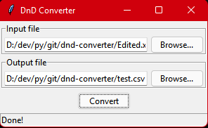

# DnD Converter

Converts an XML file produced by [Fantasy grounds](https://www.fantasygrounds.com/home/home.php) to a CSV file to be imported by [Foundry](https://foundryvtt.com/).

Run from the terminal with `$ python3 gui.py` for the GUI version, or `$ python3 main.py fileA.xml fileB.csv` to run entirely from the terminal.

